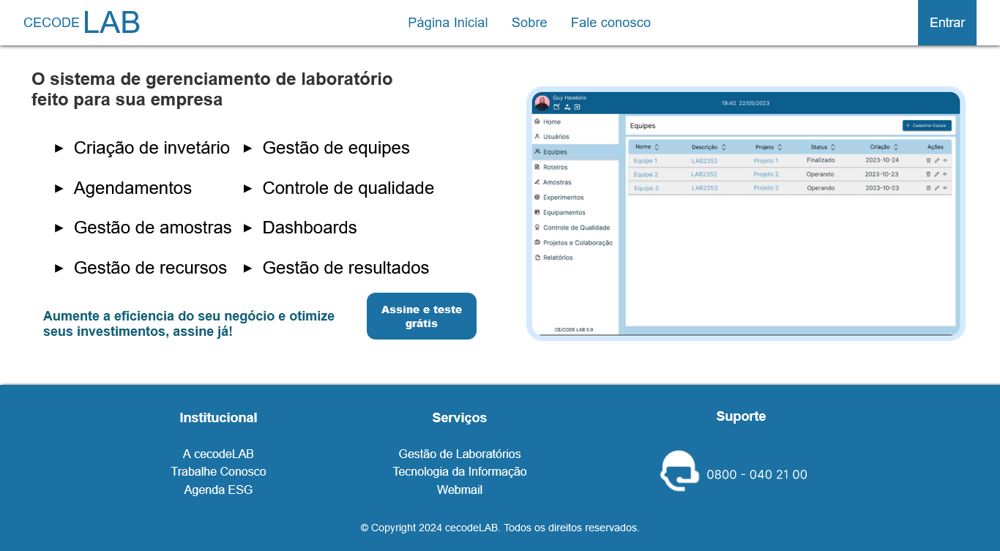

# Sistema WEB

* Projeto (front-end) da disciplina de __Desenvolvimento para WEB__ da Universidade Federal do Cariri (UFCA)
* Link: 

## Autores:

* [Francisco Eliésio de Sousa Silva](https://github.com/fcoeliesio), 2022010203.

* [Gustavo Pereira de Aragão](https://github.com/McGusT99), 2022010992.

* [Ítalo Fernandes de Oliveira Maia](https://github.com/italomaia03), 2022012656.

## Tecnologias Utilizadas:

## Screenshots:
  

## Instruções de Execução:

Para executar o projeto localmente, basta realizar o download do repositório e abrir o arquivo __index.html__ em um navegador web.